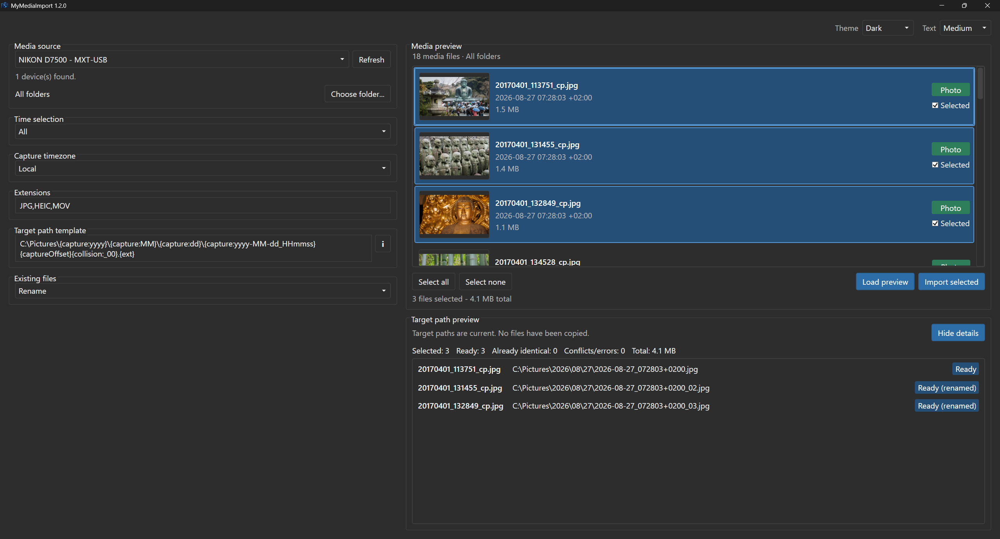
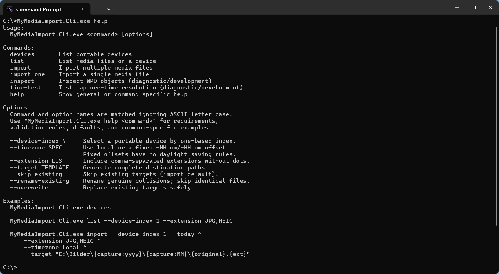

<p align="center">
  
</p>

# MyMediaImport

MyMediaImport is a small and fast Windows application for importing photos and
videos from portable devices and other media sources.

It is designed around a simple workflow: connect a device, review the newest
media, select what to import, preview the generated target paths, and copy the
files into a configurable directory structure.

The current version supports devices exposed through Windows Portable Devices
(WPD), such as an iPhone connected to a Windows PC. It provides both a native
WPF application and a command-line interface.

## Screenshots

### Desktop application



### CLI



## Current status

Current version: **1.3.0**. See [CHANGELOG.md](CHANGELOG.md) for release notes.

MyMediaImport is under active development. The application already supports the
main import workflow, but it should still be considered an early version.

Keep a separate backup of important photos and videos, and verify imported files
before deleting anything from the source device.

## Known limitations

- Only media sources exposed through Windows Portable Devices (WPD) are
  currently supported.
- RAW image formats are not currently supported but may be added in a future
  version.
- Device behavior and available thumbnail resources depend on the Windows
  device driver. When no thumbnail resource is available for a photo,
  MyMediaImport reads the original image to generate the preview.

## Features

- Native Windows desktop application with light, dark, and system themes
- Command-line interface for scripted and unattended use
- Discover portable devices through Windows Portable Devices (WPD)
- Browse and filter photos and videos by date, file extension, and media type
- Choose a source folder with recursive scanning and per-device remembered selections
- Inspect each file's device path in the filename tooltip without enlarging preview rows
- Preview generated target paths before importing
- Configurable path templates using local or UTC capture timestamps and
  filename-safe UTC offsets such as `+0200`
- Explicit handling of unknown capture time zones
- Collision handling with skip, rename, and overwrite policies
- Safe imports through temporary partial files before publishing final files
- Imported files receive the resolved capture timestamp as their file-system creation time, using the same capture timezone interpretation as target filenames. Embedded metadata (including EXIF) and last-write timestamps are not adjusted. Without a resolved capture timestamp, the creation time is left unchanged. Skipped or already imported files are not modified.
- Self-contained Windows publishing for both the desktop application and CLI

## Choose a source folder

Under **Media source**, use **Choose folder...** to restrict the preview and
import to a device folder, including its subfolders. The folder tree loads on
demand and does not modify files. Select **All folders** to remove the restriction.

The application remembers the folder separately for each device. It resolves
the saved folder names again when loading the preview; if a folder is missing
or ambiguous, choose it again instead of silently searching the whole device.

The **Media preview** header shows the folder used for the loaded preview.
Hover over a filename to see that file's full device path, including its actual
subfolders and filename. If the device does not provide enough path information,
the tooltip shows only the filename. These are virtual device paths, not local
Windows filesystem paths.

For example, selecting `Internal Storage / DCIM` includes photos in
`Internal Storage / DCIM / Camera`, but not files in a neighboring `Download`
folder. Folder names and layout depend on the device; choose the folders shown
by your device rather than assuming every device uses `DCIM / Camera`.

The CLI supports the same selection for `list` and `import`:

```powershell
MyMediaImport.Cli.exe list --device-index 1 --source-folder "Internal Storage/DCIM/Camera"
```

Use the names exposed by your device, including its storage name. Names are
matched exactly. Both `/` and `\` are accepted as CLI separators. Omitting
`--source-folder` searches all folders; CLI commands do not use desktop settings.

## Why I created this project

I wanted a focused Windows tool that makes it quick to import the newest photos
and videos from a portable device into a predictable folder and file-name
structure. The goal is an importer, not a photo-management application: it does
not maintain a media catalog and does not add albums, ratings, tags, or editing
features.

The project also serves as a shared foundation for a graphical application and
command-line automation, so the same import behavior can be used interactively,
from scripts, or through shortcuts.

## System requirements

- Windows
- A portable device accessible through Windows for WPD operations
- The .NET 10 SDK when building from source

Check the installed SDK with:

```powershell
dotnet --info
```

## Project structure

```text
src/MyMediaImport.Core          Platform-independent domain and import logic
src/MyMediaImport.Windows       Windows, COM, and WPD implementation
src/MyMediaImport.App           WPF application
src/MyMediaImport.Cli           Command-line application
tests/MyMediaImport.Core.Tests  Tests for Core logic
tests/MyMediaImport.Cli.Tests   Tests for the CLI parser and online help
tests/MyMediaImport.App.Tests   Tests for WPF presentation logic
```

## Common dotnet commands

Run all commands below from the repository root.

### Invoke-Build workflow

Restore the repository-local Invoke-Build tool once after cloning or updating
the tool manifest:

```powershell
dotnet tool restore
```

The common development tasks are then available through a single build script:

```powershell
dotnet ib build
dotnet ib test
dotnet ib run
dotnet ib runcli -CliArguments help
dotnet ib pack
dotnet ib install
dotnet ib release
```

`build` is the default task, so `dotnet ib` builds the complete solution.
`pack` creates fresh self-contained App and CLI staging files and packages them
as an Inno Setup installer under `Setup\Output`. `release` runs all tests and
then creates the installer. `install` builds and launches the installer.

### Restore dependencies

```powershell
dotnet restore MyMediaImport.sln
```

`dotnet build`, `dotnet test`, and `dotnet run` normally restore dependencies
automatically. A separate `restore` is therefore usually only necessary during
initial setup or troubleshooting.

### Build the complete solution

```powershell
dotnet build MyMediaImport.sln
```

Create a release build:

```powershell
dotnet build MyMediaImport.sln --configuration Release
```

### Run all tests

```powershell
dotnet test MyMediaImport.sln
```

Run only the Core tests:

```powershell
dotnet test tests/MyMediaImport.Core.Tests/MyMediaImport.Core.Tests.csproj
```

### Run the CLI

Show the general online help:

```powershell
dotnet run --project src/MyMediaImport.Cli/MyMediaImport.Cli.csproj -- help
```

Show help for a specific command:

```powershell
dotnet run --project src/MyMediaImport.Cli/MyMediaImport.Cli.csproj -- help import
```

Show the formal syntax for a command:

```powershell
dotnet run --project src/MyMediaImport.Cli/MyMediaImport.Cli.csproj -- help import syntax
```

List portable devices:

```powershell
dotnet run --project src/MyMediaImport.Cli/MyMediaImport.Cli.csproj -- devices
```

List media from the first device:

```powershell
dotnet run --project src/MyMediaImport.Cli/MyMediaImport.Cli.csproj -- list --device-index 1 --limit 20
```

The double dash `--` separates the options for `dotnet run` from the arguments
passed to MyMediaImport.Cli.

### Run the WPF application

```powershell
dotnet run --project src/MyMediaImport.App/MyMediaImport.App.csproj
```

### Run without rebuilding

After a successful build, `--no-build` can reduce startup time:

```powershell
dotnet run --project src/MyMediaImport.Cli/MyMediaImport.Cli.csproj --no-build -- help
```

### Clean build outputs

```powershell
dotnet clean MyMediaImport.sln
```

This command removes the build outputs generated by MSBuild for the solution.

## Build the installer

The installer task creates private self-contained staging directories and then
packages both the desktop application and CLI:

```powershell
dotnet ib pack
```

The target computer does not need a separate .NET installation. The installer
shows the license terms for the bundled Microsoft .NET runtime components and
writes its executable to `Setup\Output`. Files under `artifacts\publish` are
intermediate packaging input, not a separate distribution. The Start menu
contains shortcuts for the desktop application and a command prompt that opens
in the CLI directory and displays the CLI help. When desktop icons are selected
during setup, both shortcuts are also created on the desktop; the CLI shortcut
uses the Command Prompt icon.

## Contributing

MyMediaImport is a personal hobby project maintained in my spare time.

I am not accepting pull requests and cannot guarantee support, bug fixes, or new
features. Bug reports and suggestions may be submitted through GitHub Issues.

You are welcome to fork the project for your own development.

## License

MyMediaImport is available under the [MIT License](LICENSE).

## Acknowledgements

MyMediaImport was created by Christian Pistor with extensive assistance from
OpenAI Codex.
